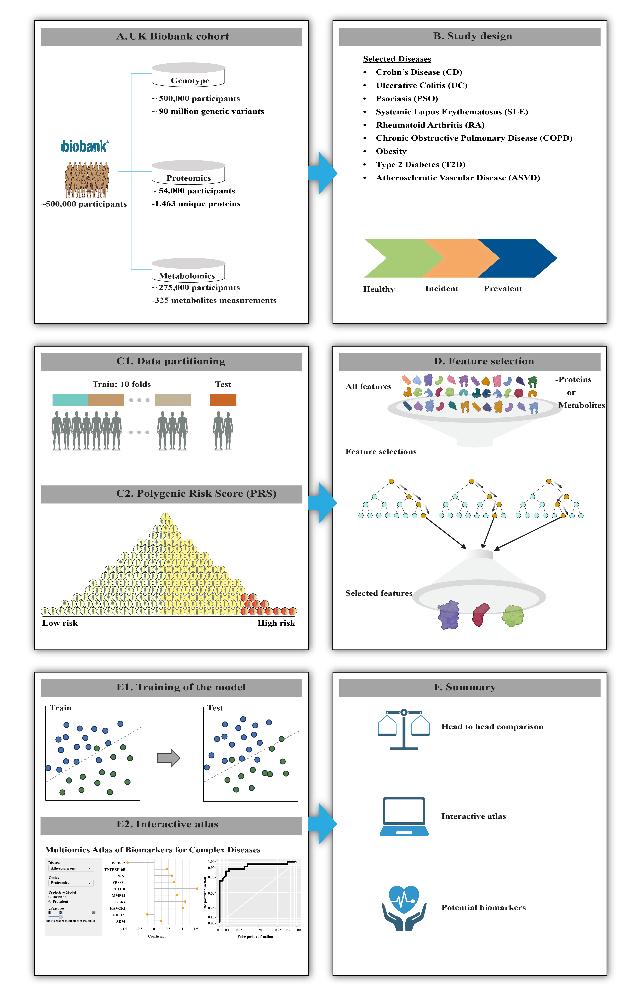

# An interactive atlas of genomic, proteomic, and metabolomic biomarkers indicatesthat combinations of small numbers of proteins suffice to predict and diagnose complex diseases

**S**wedish **D**igital **T**win **C**onsortium - **C**enter for **P**ersonalized **M**edicine

## General information

This is a github page dedicated to a manuscript TODO:link. The aim of the manuscript was to create an interactive multiomic atlas for complex diseases (available at macd.shinyapps.io/ShinyApp/) and compare the predictive and diagnostic potential of different omics

## Overview

**Overview figure of the study.** Figure 1. Overview of the study. A) Genomic, proteomic, and metabolomic data from patients with B) nine incident or prevalent complex diseases and age/sex matched controls were C1) analysed using cross-validation and holdout test datasets, and C2) A polygenic risk score was computed for genomic data, while D) feature selection was performed for proteomics and metabolomics. E1) A machine learning model was trained and tested to E2) construct an interactive atlas that can be found at macd.shinyapps.io/ShinyApp/. F) In summary, we present a head-to-head comparison of different omics layers, and an interactive atlas to derive context-dependent types and numbers of potential biomarkers for incidence and prevalence of the diseases   

## Accsess to the data

Raw data from the UK Biobank are available for approved researchers through the UK Biobank data-access protocol. 

## Guide for the code

The code is divided into 3 main parts based on the coding language. The are firstly processed using the *Decodes2convert_UKBB_file.sh* and *Decode_UKBBdata_ICD9and10.py*. The proteomics and metabolomics data are further processed using the R script *UKBB_proteomics_dataPre_processing.py* and *Metabolomics_secondPhase_dataPreprocessing.R* respectively, while genomics data are processed using *PRS_construction.sh*. The next step is to select the patients for different disease and their age/sex matched healthy controls using the *Patient_selection.R* script. The output of this file is directly used in the python files *prediction_pipeline...* where the prediction pipeline (imputation, feature selection, training of the model) is run. The final results in the manuscript are created using *figures.R* file, and there is a specific folder that can be used to recreate the shiny application. 

